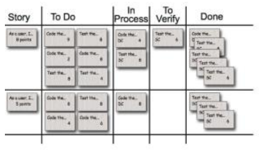

# Domande piu frequenti ingeneria del software 

## considerazioni preliminari

1. cosa si intende per software?  
L’insieme di programmi, procedure, regole e documentazione associata, e i dati (relativi
all’operatività di un sistema di elaborazione).

2. principali aree applicative software?
* Mobile apps
* Web apps
* Information systems (ERP)
* Scientific computing
* Medical devices
* Industrial and process control
* Embedded systems
* Real-time systems
* Big Data
* Defense systems
* System software (OS, DBMS, ...)
* Network software (router, ...)
* Tools (git, ...)

3. proprietà esseziali software?
* Complessità
* Conformità
* Modificabilità
* Invisibilità

4. conseguenza complessità software?  
Le entità software sono considerati tra i costrutti più complessi dell’essere umano perchè ha
componenti tutte differenti. Questo porta anche all’ esplosione combinatoriale degli stati.
La complessità cresce esponenzialmente al crescere della dimensione.
La conseguenza è che un prodotto software è difficile da comprendere e da controllare.  

5. cosa si intende per conformita?  
Il software è un prodotto dell’uomo: non esistono leggi naturali unificanti
Il software si deve adattare all’ambiente esterno per via delle molte interfacce hardware,
di più utenti con profili differenti, e dei processi lavorativi predefiniti
La conformità forzata aggiunge maggiore complessità

6. effetto cambiamento continuo software?  
C’è sempre pressione per il cambiamento del software tuttavia il cambiamento continuo
degrada la qualità iniziale del software

7. conseguenza invisibilità?  
Il software è un’entità invisibile e non può essere catturato completamente da un’unica
rappresentazione geometrica, di conseguenza ci sono problemi di comunicazione.
    * flusso di controllo
    * flusso dei dati
    * dipendenze delle variabili
    * sequenze temporali

8. quando e da chi perchè è stato coniato ingegneria dei software?  
Durante un convegno NATO nel 1968 in risposta alla “crisi del software” 
    * Progetti in ritardo
    * Progetti che sfondano i costi preventivati
    * Sistemi non all’altezza dell’affidabilità richiesta

9. cosa si intende per ingegneria del software?  
La disciplina tecnologica e manageriale che riguarda la produzione sistematica e la
manutenzione dei prodotti software che vengono sviluppati e modificati entro i costi e i
tempi preventivati, e con qualità accettabile

10. differenza fra costo software e costo hardware?  
Il costo del software è un costo di progetto non di produzione, ed è principalmente un costo
di sforzo (umano).

11. come si misura il costo del software e cosa si intende su time to market?  
Il costo del software è principalmente un costo di sforzo umano ed è misurato in [ ore |
giorni | mesi | anni ] – persona. Il ‘’time to market’’ è il tempo che intercorre dall’idea
iniziale al rilascio del prodotto (è un fattore critico per molti progetti).

12. cos'è la legge di brooks?  
Aggiungere persone a un progetto già in ritardo ha un effetto contrario alle intenzioni:
* Addestramento
* Comunicazione intragruppo n(n-1)/2

13. cosa si intende per qualità del software?   
Per misurare la qualità del software ci si affida a un modello di qualità che
prevede la decomposizione del concetto in attributi fino ad arrivare a misure. I
parametri a cui si fa riferimento sono funzionalità, affidabilità, efficienza,
usabilità, manutenibilità, portabilità

14. perchè sono importanti i processi software?  
Visto che un processo software descrive quali sono le attività che concorrono a sviluppare
un prodotto software e come le attività sono collegate tra loro, la qualità del software
dipende proprio dalla qualita del processo software.

15. cosa sono i processi software?  
che un processo software descrive quali sono le attività che concorrono a sviluppare un
prodotto software e come le attività sono collegate tra loro

16. principali attività tecniche o organizzative?  
    **Attività tecniche:**
    * Analisi dei requisiti (requirements analysis)
    * Progettazione (design)
    * Realizzazione (implementation)
    * Collaudo (testing)
    * Messa in esercizio (deployment)
    * Conduzione operativa (operation)
    * Manutenzione (maintenance)  

    **Attività organizzative:**
    * Gestione del progetto (project management)
    * Gestione della configurazione (configuration management)
    * Assicurazione della qualità (quality assurance)

17. cosa caratterizza lo stile di processo a cascata?
    * Suddivide il progetto in base alle attività tecniche
        * Le fasi coincidono con le attività
    * Si passa a una fase successiva solo se si completa l’attività e * si supera il punto di controllo 
        * Tornare indietro è possibile ma come eccezione  

    **Problemi**
    * Rischio elevato: difficile stabilire che tutto procede veramente bene
    * Difficile da applicare se i requisiti sono poco noti o volatili
    * Time to market ritardato

18. cos' è il time boxing?  
* In generale prevede di snellire il processo dedicando ad ogni operazione che lo costituisce
degli slot di tempo ben definiti

19. cosa intende per sviluppo pianificato o sviluppo agile?
**Sviluppo pianificato**
* Piano dettagliato delle attività creato a monte
* Molta documentazione come forma di comunicazione indiretta
* Stile di processo a cascata
* Adatto per progetti con requisiti noti a priori e stabili nel tempo
**Sviluppo Agile**
* Fortemente adattivo rispetto ai cambiamenti in corso d’opera
* Poca documentazione: enfasi sulla comunicazione diretta tra persone
* Stile di processo iterativo: iterazioni corte e di durata costante (timeboxed)

20. quali sono i principi del manifesto dello sviluppo agile (sono diversi dai valori)?
* La nostra massima priorità è soddisfare il cliente
rilasciando software di valore, fin da subito
e in maniera continua.
* Accogliamo i cambiamenti nei requisiti,
anche a stadi avanzati dello sviluppo.
I processi agili sfruttano il cambiamento
a favore del vantaggio competitivo del cliente.
* Consegnamo frequentemente software funzionante,
con cadenza variabile da un paio di settimane a un paio di mesi,
preferendo i periodi brevi.
* Committenti e sviluppatori devono lavorare insieme
quotidianamente per tutta la durata del progetto.
* Fondiamo i progetti su individui motivati.
Diamo loro l'ambiente e il supporto di cui hanno bisogno
e confidiamo nella loro capacità di portare il lavoro a termine.
* Una conversazione faccia a faccia
è il modo più efficiente e più efficace per comunicare
con il team ed all'interno del team.
* Il software funzionante è il principale metro di misura di progresso.
* I processi agili promuovono uno sviluppo sostenibile.
Gli sponsor, gli sviluppatori e gli utenti dovrebbero essere in grado
di mantenere indefinitamente un ritmo costante.
* La continua attenzione all'eccellenza tecnica
e alla buona progettazione esaltano l'agilità.
* La semplicità - l'arte di massimizzare la quantità
di lavoro non svolto - è essenziale.
* Le architetture, i requisiti e la progettazione
migliori emergono da team che si auto-organizzano.
* A intervalli regolari il team riflette su come
diventare più efficace, dopodiché regola e adatta
il proprio comportamento di conseguenza

21. metodi agili più noti //DA RIVEDERE?
* Extreme Programming (XP) esprime 12 regole o pratiche per lo
sviluppo software (Pair Programming, Planning Game, Test Driven
Development, Whole Team...)
* Scrum:
prevede di dividere il progetto in blocchi rapidi di lavoro (Sprint) alla fine di
ciascuno dei quali creare un incremento del software. Esso indica come definire i
dettagli del lavoro da fare nell'immediato futuro e prevede vari meeting con
caratteristiche precise per creare occasioni di ispezione e controllo del lavoro
svolto.
* Kanban:
Descritto in 5 proprietà:
    * Visualizzare il flusso di lavoro
    * Limitare il Work-in-Process
    * Misurare e gestire il flusso
    * Rendere le politiche di processo esplicite
    * Utilizzare i modelli per riconoscere le opportunità di miglioramento

22. citare almeno 3 pratiche dell' extreme programming //DA RIVEDERE?
* Pair programming
Due programmatori lavorano da soli su una sola workstation
* Planning Game
Riunione di pianificazione che avviene una volta per iterazione (di solito una volta
a settimana)
* Test Driven development
I test automatici (sia unitari che di accettazione) vengono scritti prima di scrivere
il codice.
* Whole Team
Il cliente non è colui che paga il conto , ma la persona che realmente utilizza il
sistema. Il cliente deve essere presente e disponibile a verificare.

23. cos'è una kanban board?
è lo strumento utilizzato nella metodologia di sviluppo software Kanban.
Possiede diverse colonne tra cui le principali sono To do, In progress, Review e Done.

24. cos'è il work in progress(WIP)?
È il numero di attività che su cui un team sta lavorando. Una delle principali proprietà del
Kanban è limitare il WIP.

25. cos’è una valutazione retrospettiva?
La retrospettiva è un incontro che si tiene alla fine di un’iterazione di sviluppo Agile.
Durante la retrospettiva, il team riflette su quanto accaduto durante l’iterazione appena
trascorsa e individua le azioni per migliorare il futuro. Si individuano:
Cose da tenere
ciò che ha funzionato bene e che si intende ripetere in futuro
Problemi
aree in cui qualcosa non va come dovrebbe
Cose da provare
cambiamenti che potrebbero migliorare il processo

26. cos è un analisi post mortem?
Le revisioni post mortem si concentrano sull'estrazione di lezioni dal team di sviluppo una
volta che il
il software viene consegnato. Le revisioni post mortem devono essere condotte poco dopo
la fine del
progetto in modo che le informazioni non vengono perdute a causa del progetto successivo

27. cos'è uno sprint?
È un iterzione durante la quale i progetti scrum fanno progressi. Durante questa fase il
prodotto viene progettato, realizzato e testato.

28. quanto dura uno sprint in scrum?
La durata tipica è in genere di 2-4 settimane o un
mese di calendario

29. quali sono i vataggi o svantaggi di uno sprint breve o lungo?
Una durata costante permette una migliore cadenza

30. se è possibile chiedere al team di aggiugere requisiti e perchè?
* Durante uno Sprint non sono accettate richieste di
modifiche ai requisiti

31. quali sono i ruoli principali in scrum?
* Product Owner
* ScrumMaster
* Team

32. cosa fa in product owner?
* È responsabile del valore del prodotto
* Gestisce il product backlog (gestisce le caratterisitche funzionali e
non funzionali del prodotto, assegna le priorità alle feature,adatta le
feature e le priorità a ogni iterazione).
* Accetta o rifiuta i risultati del lavoro del Team di Sviluppo

33. cosa fa il master(o ScrumMaster)?
È una guida al servizio del Team di Sviluppo e del Product Owner. Aiuta a creare e a
modificare gli elementi del product Backlog, facilita gli eventi scrum e mostra le informazioni
chiave per il processo di sviluppo

34. quante persone possono stare in un team e perchè?
Un team dovrebbe avere da 3 a 8 persone per la regola delle 2 pizze : per sfamare un team
dovrebbero essere necessarie non più di due pizze.

35. cosa si intende per autogestione in uno sprint?
Nessuno (neanche lo Scrum Master) dice al Team di Sviluppo come
trasformare il Product Backlog in Incrementi di prodotto potenzialmente rilasciabili

36. cosa si fa in uno sprint planning?
* Valutazione delle priorità nel Product Backlog
* Scelta dello Sprint Goal
* Selezione degli item da completare nello Sprint
* Creazione dello Sprint Backlog(identificazione dei task e stima)

37. cos' è uno sprint backlog?
Una lista di tutto il lavoro richiesto sul progetto, è l’unica fonte di requisiti per le modifiche
da apportare al prodotto. Le priorità sono stabilite dal Product Owner e le stime degli item
pronti per uno Sprint sono stabilite dal Team di Sviluppo.

38. cosa si fa nei Daily scrum meeting (o semplicemente meeting) quanto dura e perchè si
sta in piedi?
Nel Daily scrum meeting tutti i componenti devono rispondere alle seguenti domande: Cosa
hai fatto ieri?;
Cosa farai oggi?; Ci sono problemi nella prosecuzione del lavoro?
La sua durata è di 15 minuti e si rimane in piedi per evitare che si prolunghi inutilmente.

39. chi partecipa allo sprint review?
Allo sprint review partecipano tutto il team ed eventuali esterni sono benvenuti.

40. quando si fanno le stime e chi le fa nello sviluppo agile?
Le stime degli item sono fatte all’inizio di ogni Sprint dal Team di sviluppo

41. come vengono espressi i requisiti funzionali?
I requisiti funzionali sono espressi mediante le user stories

42. come viene espressa una user story?
Le user stories sono espresse mediante un Template:
In qualità di <ruolo utente>,
voglio <obiettivo>
[in modo tale da <motivo>]

43. come viene e quando viene specificato il dettaglio di una user story?
* //PENDENTE...

44. se una user story viene specificata nel product backlog o nello sprint backlog?
Le user story sono inserite nel product backlog. Nello sprint backlog sono inserite le user
story per uno sprint.

45. perchè è importante un obiettivo in uno sprint?
Perchè garantisce coerenza nel lavoro del team (che viene minata da iniziative individuali
senza un’obiettivo comune)

46. chi gestisce lo sprint backlog?
La gestione è di esclusiva pertinenza del Team di
Sviluppo

47. cos'è una scrum board ed esempio?
Una Scrum Board è uno strumento che aiuta il team a rendere visibili gli item dello Sprint
Backlog

48. cos'è uno sprint burn down chart ed esempio?  
Uno sprint burn down chart è una rappresentazione grafica del lavoro da fare in uno sprint
nel tempo

49. i valori del manifesto agile
* Gli individui e le interazioni più che i processi e gli strumenti
* Il software funzionante più che la documentazione esaustiva
* La collaborazione col cliente più che la negoziazione dei contratti
* Rispondere al cambiamento più che seguire un piano  
Ovvero, fermo restando il valore delle voci a destra, consideriamo più importanti le voci a
sinistra.

50. chiede i principi e devi dire se sono veri o meno?  
//COMPLETARE
* La nostra massima priorità è soddisfare il cliente
rilasciando software di valore, fin da subito
e in maniera continua.
* Accogliamo i cambiamenti nei requisiti,
anche a stadi avanzati dello sviluppo.
I processi agili sfruttano il cambiamento
a favore del vantaggio competitivo del cliente.
* Consegnamo frequentemente software funzionante,
con cadenza variabile da un paio di settimane a un paio di mesi,
preferendo i periodi brevi.
* Committenti e sviluppatori devono lavorare insieme
quotidianamente per tutta la durata del progetto.
* Fondiamo i progetti su individui motivati.
Diamo loro l'ambiente e il supporto di cui hanno bisogno
e confidiamo nella loro capacità di portare il lavoro a termine.
* Una conversazione faccia a faccia
è il modo più efficiente e più efficace per comunicare
con il team ed all'interno del team.
* Il software funzionante è il principale metro di misura di progresso.
* I processi agili promuovono uno sviluppo sostenibile.
Gli sponsor, gli sviluppatori e gli utenti dovrebbero essere in grado di mantenere indefinitamente un ritmo costante.
* La continua attenzione all'eccellenza tecnica
e alla buona progettazione esaltano l'agilità.
* La semplicità - l'arte di massimizzare la quantità
di lavoro non svolto - è essenziale.
* Le architetture, i requisiti e la progettazione
migliori emergono da team che si auto-organizzano.
* A intervalli regolari il team riflette su come
diventare più efficace, dopodiché regola e adatta
il proprio comportamento di conseguenza

51. cosa fanno i comandi diff e patch?
diff e patch sono due comandi presenti nei sistemi Unix (e quindi anche su Linux) che
permettono di creare e applicare i files di patch.
diff confronta 2 files o 2 sottodirectories riportando in output le differenze riscontrate.
diff viene anche impiegata per generare un file di patch.
Il comando patch permette di applicare le differenze ad alcuni file, al fine di effettuare
aggiornamenti da vecchie a nuove versioni.

52. cosa consiste il controllo locale di versione?
È una parte della gestione della configurazione del
software che consente di tenere traccia e controllare le modifiche.
È utile per un team di sviluppatori che lavorano sullo stesso file.

53. riempire la figura secondo il controllo localizzato versione?
Lo sviluppatore ha un db locale (repository) che tiene traccia di tutti le modifiche  

54. Controllo centralizzato di versione?
Un unico repository condiviso su un server contenente tutti i file versionati. Gli sviluppatori
scaricano una copia locale (checkout) dal server al computer locale e registrano (commit) i
file modificati sul repository
condiviso nel server. Se c’è un conflitto, chi arriva per ultimo lo risolve (merge).

55. Controllo distribuito di versione?
repository con storia completa di tutte le versioni. Gli sviluppatori copiano un intero
repository (clone)
o ne creano uno nuovo (init), lavorano offline sui file della copia locale, registrano (commit) i
file modificati sul repository locale effettuano il merge su un repository remoto (push) o
chiedono al proprietario di occuparsi lui del merge (pull).  

56. 53-cos'è un commit?  
Inserisce nel repository locale le istantenee delle modifiche dei file tracciati che erano
presenti nella staging area.

57. cos'è un merge?
È la fusione di due branch.

58. Comando git merge
Fonde il branch specificato, con tutte le modifiche (commit) effettuate su di esso, nel
branch corrente.

59. quali sono i problemi del controllo di versione e qual'è il problema?
Controllo locale di versione: nessun supporto alla collaborazione
Controllo centralizzato di Versione: branching & merging complicati, specialmente per
progetti grandi
Controllo distribuito di versione: curva di apprendimento per via dei molteplici workflow

60. come si crea una repo locale di git cos’è una staging area,working directory cos 'è e come si passa?
* Creare una repository da zero: git init <nome_repository>
* Creare una repository copiandola da remoto: git clone <url>
* Working directory: contiene i file modificati
* Staging area: contiene i file modificati che si vuole tracciare. Si passa ad essa dalla working
directory con git add.
* Con git commit si passano le istantanee al repository locale

61. cosa serve git add?
aggiunge le modifiche alla staging area

62. cosa serve git commit
Inserisce nel repository locale le istantenee delle modifiche dei file tracciati che erano
presenti nella staging area.

63. cosa fa git push
Aggiorna il server remoto con i cambiamenti locali

64. cosa fa git pull
Scarica e unifica i commit remoti nella propria working directory

65. quali sono le linee guida per scrivere bene un commit?
Iniziare il messaggio con un breve riassunto delle modifiche. Viene separato dal corpo del
messaggio seguente da una riga vuota. Il corpo del messaggio deve rispondere alle
domande: Qual è stata la motivazione del cambiamento? - In che cosa differisce dalla
precedente implementazione?
Si usa il tempo imperativo e presente.

66. scrivere un esempio di commento significativo di un commit?
Aggiunta la funzione stampaId alla classe Members
La funzione restituisce il valore del campo ID associato a un membro

67. 64-cos'è un branch?
è una linea di sviluppo indipendente

68. a che serve un branch?
Consente di lavorare contemporaneamente a più versioni di un repository

69. cosa fa git checkout (brach name)?
Permette di spostarsi sul branch con il nome specificato

70. cosa fa git branch name?
Crea un nuovo branch a partire da quello corrente  

71. cos è un issue in github?
Una issue rappresenta una qualsiasi tipologia task: una feature, un bug fix o un
miglioramento da apportare al progetto

72. elencare i passi del github flow
* Crea un branch
* Aggiungi i commit
* Apri una pull request
* Discuti e valuta
* Merge e deploy

73. qual'è la corrispondenza tra branch e issue nel github flow?
Viene creato un singolo branch per ogni issue, in modo da poter aprire una pull request
dopo che le modifiche sono state ultimate

74. a che serve una pull request?
Una pull request consente di comunicare agl’altri componenti del gruppo le modifiche
apportate sulla repository di GitHub.

75. come si fa ad agganciare una pull request all'issue?
commentando la pull requesto con #n dove n è il numero della issue

76. cos'è un modello?
Un modello è una rappresentazione semplificata della realtà.

77. perchè creare modelli
* Perché la realtà può essere troppo complessa
* I modelli aiutano a comprendere e a comunicare

78. cosa si intende per prospettiva concettuale nella modellazione visuale software?
* Rappresentazione di concetti caratteristici del dominio studiato (**domain model**)
* È indipendente dal software

79. qual'è la differenza per creare bozze (da rivedere)?  
* Lo scopo principale è favorire la comprensione e la comunicazione nelle discussioni
* Usato per aiutare a concentrarsi su alcuni aspetti di un sistema software
* I diagrammi sono creati improvvisando e in modo collaborativo (anche con uso di lavagne)

80. quali sono i criteri fondamentali
* Criteri fondamentali
    * Selettività
        * Solo alcuni aspetti del sistema software sono modellati graficamente
        * Qualsiasi informazione può essere soppressa: l’assenza di qualcosa non significa che
non esista
* Espressività
    * Diagrammi intesi come figure

//corregir la numeracion desde aqui
79. da un diagramma e dice se è strutturale o comportamentale o quale è
* Diagramma strutturale (structure diagram)
* Diagramma delle classi (class diagram)
* Diagramma dei componenti (component diagram)
* Diagramma di struttura composita (composite structure diagram)
* Diagramma di deployment (deployment diagram)
* Diagramma degli oggetti (object diagram)
* Diagramma dei package (package diagram)
* Diagramma comportamentale (behavior diagram)
* Diagramma delle attività (activity diagram)
* Diagramma dei casi d’uso (use case diagram)
* Diagramma di macchina a stati (state machine diagram)
* Diagramma di interazione (interaction diagram)
* Diagramma di sequenza (sequence diagram)
* Diagramma di comunicazione (communication diagram)
* Diagramma di interazione generale (interaction overview diagram)
* Diagramma di temporizzazione (timing diagram)

80. cos'è un requisito?
* E' una caratteristica o condizione che un sistema è tenuto a rispettare.
* La formulazione dei requisiti chiarisce il modo in cui i bisogni dei committentidovranno essere soddisfatti dai progettisti.
* L’insieme dei requisiti delimita lo spazio delle soluzioni ammissibili.

81. cos'è una feature?
* E’ un requisito funzionale.

82. cosa si intende per requisiti funzionali?
* Per requisiti funzionali si intendono i requisiti specifici che rappresentano una funzionalità,
descrivono le interazioni tra il sistema e il suo ambiente indipendentemente dalla sua
implementazione.

83. cosa si intende per elicitazione dei requisiti?
Per elicitazione si intende la scoperta dei requisiti, è il processo di acquisizione di
informazioni sul sistema da sviluppare.

84. perchè è difficile scoprire dei requisiti all'inizio dello sviluppo?  
**Perché nel mondo ideale:**
• il committente comunica i requisiti alla partenza del progetto
• il compito degli analisti è soltanto quello di acquisirli e di comprenderli
**Mentre nel mondo reale:**
• la scoperta dei requisiti comporta una serie ripetuta di interazioni e discussioni tra i diretti
interessati
• Il committente non è quasi mai in grado di trasmettere agli analisti un elenco di requisiti
completo e dettagliato. 

85. quali sono le principali tecniche di elicitazione dei requisiti?
* Interviste (1-1), workshop (M-M)
* Identificazione degli interlocutori (stackholder)
* Ruolo attivo degli analisti
* Risoluzione di punti di vista contraddittori
* Osservazione diretta dei processi/sistemi esistenti
* Recupero e analisi documentazione da sistemi esistenti
* Prototipi UI

86. esempio di requisito specifico in forza di predicato verbale o user story?
**Esempi di requisiti specifici in forza di predicato verbale:**
* RF1: Il sistema deve accettare pagamenti con carte di credito
* RF2: Il sistema deve verificare l’identità dell’utente mediante tessera
* RNF1: Il sistema deve essere disponibile 7 giorni su 7, 24 ore su 24
* RNF2: Il sistema deve rispondere a ogni comando dell’utente entro 4 sec
**Esempi di requisiti specifici in forza di user story**:
* Effettua registrazione, effettua ordine, controlla lo stato dell’ordine

87. cos'è un caso d'uso?
* Rappresentano una funzionalità (feature) che il sistema offre ai suoi utilizzatori (attori), è la
narrazione delle interazioni tipiche tra attori e sistema.

89. cosa si intende per attore?
* Per attore si intende il ruolo che qualcuno o qualcosa svolge nell’interagire con il sistema.
* E’ esterno al sistema
* tutti i casi d’uso invece rientrano nel contesto del sistema
* Può essere:
* una classe di persone fisiche (es. fornitore)
* un altro sistema (es. sistema di contabilità)
* un dispositivo hardware esterno (es. sensore o attuatore)

90. cosa si intende per scenario?
* Per scenario si intende il dialogo tra gli attori e il sistema.
Uno scenario definisce cosa accade nel sistema in seguito all’evento di innesco
* come e quando il caso d’uso inizia
* chi inizia il caso d’uso
* interazione tra attore/i e caso d’uso e cosa viene scambiato
* come e quando c'è bisogno di dati memorizzati o di memorizzare dati
* come e quando il caso d’uso termina

91. se i requisiti sono validati o verificati?
* Obiettivo: assicurarsi che la specifica dei requisiti del software rappresenti in modo
accurato e chiaro i bisogni del committente
* Revisioni mediante ispezione
    * Basate su lettura individuale e discussione in gruppo
    * Utilizzo di checklist
        * Difetti classificati
        * Omissione
        * Informazione ambigua
        * Inconsistenza
        * Fatto non corretto
        * Informazione estranea

92. cosa si intende per tracciabilità in avanti nei requisiti o a ritroso?
Tracciabilità in avanti
* E’ possibile nei documenti di progetto, codifica, testing e manutenzione fare riferimento a
specifici requisiti;
Tracciabilità a ritroso
* Riferimento a leggi, regolamenti, software esistente

93. cosa si intende per gestione?
Per gestione si intende le procedure per far sì che:
* solo le persone autorizzate possano effettuare cambiamenti
* non sia possibile effettuare cambiamenti in modo concorrente
* si tenga traccia dei cambiamenti in modo tale poter tornare indietro
* si tenga traccia di chi ha effettuato il cambiamento e delle motivazioni

94. esempi user story?
In qualità di cliente occasionale, voglio visualizzare le foto dell'albergo selezionato in modo
tale da decidere se effettuare la prenotazione.

95. cos'è un epic
* E’ Una user story da decomporre perché troppo grande per essere implementata in una sola
iterazione.

96. cos' è un modello di dominio?
* E’ un modello utile per comprendere e comunicare i concetti fondamentali di un dominio
(ambito)
    * E’ indipendente dal software
    * Anche detto “modello concettuale”
* Base di partenza per il design della «business logic»

97. cos'è un modello concettuale?
* E’ il modello di dominio utile per comprendere e comunicare i concetti fondamentali di un
dominio (ambito).

98. cosa si utilizza per rappresentare un modello di dominio?
* Si utilizza un diagramma delle classi con prospettiva concettuale
    * Rappresentazione visuale di concetti caratteristici del dominio studiato

